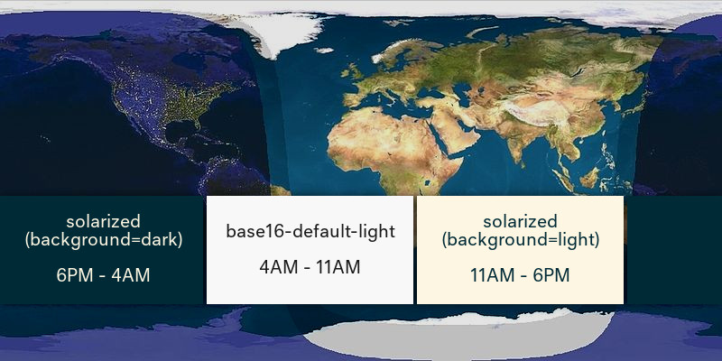

# night-and-day

A **vim theme scheduler**. Divide your day into as many intervals as you like, assigning each interval its own theme.



## installation

If you don't have a preferred approach to **plugin management**, consider trying [vim-plug](https://github.com/junegunn/vim-plug), which can be installed with:

~~~
curl -fLo ~/.vim/autoload/plug.vim --create-dirs \
    https://raw.githubusercontent.com/junegunn/vim-plug/master/plug.vim
~~~

To **install night-and-day** via vim-plug, add the following to the top of your `vimrc`:

~~~
call plug#begin('~/.vim/plugged')
Plug 'nightsense/night-and-day'
call plug#end()
~~~

Then, within vim, run `PlugUpdate`.

## configuration

You'll need to add a "nested list" containing your settings to `vimrc`. Like so:

```
let g:nd_themes = [
  \ ["4:00",  "base16-default-light", "light" ],
  \ ["11:00", "solarized",            "light" ],
  \ ["18:00", "solarized",            "dark"  ],
  \ ]
```

- column 1: the **starting time** for each theme in `H:MM`/`HH:MM` format (valid range: `0:00`-`23:59`)
  - arrange your list in chronological order, starting from midnight (otherwise an alert will be triggered)
- column 2: the **name** of each theme (as used by the vim command `colorscheme`)
- column 3: the **background state** for each theme (either `light` or `dark`)

All three columns are required for each entry in the list.

The above sample configuration, which reflects the world map image at the top of this readme, will activate:

- `base16-default-light` 4-11AM
- `solarized` (light background) 11AM-6PM
- `solarized` (dark background) 6PM-4AM

### sun-relative times

In addition to absolute times, you can set times **relative to sunrise/sunset**.

```
let g:nd_themes = [
  \ ["sunrise-3:00", "base16-default-light", "light" ],
  \ ["11:00",        "solarized",            "light" ],
  \ ["sunset+0:00",  "solarized",            "dark"  ],
  \ ]
let g:nd_latitude = '50'
let g:nd_timeshift = '74'
```

The above sample configuration will activate:

- `base16-default-light` from 3 hours before sunrise to 11AM
- `solarized` (light background) from 11AM until sunset
- `solarized` (dark background) from sunset to 3 hours before sunrise

Thus, for sun-relative times, the **time format** remains the same; simply add one of the four relative prefixes (`sunrise+`, `sunrise-`, `sunset+`, `sunset-`).

The above configuration also features two new variables. The first, `g:nd_latitude`, is **mandatory** when using any sun-relative times in your schedule. There are 23 permitted values; choose the one nearest your current latitude.

region          | permitted values for `g:nd_latitude`
:--------------:|:-----------------------------------:
north temperate | `30` `40` `45` `50` `55` `57.5` `60` `62.5` `65`
tropics         | `-20` `-10` `0` `10` `20`
south temperate | `-65` `-62.5` `-60` `-57.5` `-55` `-50` `-45` `-40` `-30`

The second additional variable, `g:nd_timeshift`, is **optional**, though appropriate for most users. This variable specifies an offset (in minutes, positive or negative) for sunrise/sunset times to be shifted. An offset is necessary to account for one's longitudinal position within a timezone, as well as daylight saving time (if applicable).

The simplest way to determine the appropriate value for `g:nd_timeshift` is to start vim with the following configuration:

```
let g:nd_themes = [
  \ ["sunrise+0:00", "default", "light" ],
  \ ["sunset+0:00",  "default", "light" ],
  \ ]
let g:nd_latitude = 'LL'
let g:nd_timeshift = '0'
```

...where `LL` is the value closest to your current latitude. Then, from the vim command line, run `:call NdSchedule()`. This will print your theme schedule, allowing you to view the precise times being used for sunrise and sunset.

Next, get today's exact sunrise/sunset times via an online search. (With something like "[YOUR LOCATION] sunrise sunset", Google will likely give you the information in one of those answer boxes.) Finally, set `nd_timeshift` to the appropriate value to achieve accurate sunrise/sunset times. Relaunch vim and run `:call NdSchedule()` again to confirm the offset.

> If your region features daylight saving time (DST) for part of the year, you can take care of the adjustment automatically by wrapping `g:nd_timeshift` in an "if statement". For instance, to activate DST for March through September:
>
> ```
> if strftime("%m") > 2 && strftime("%m") < 10
>   let g:nd_timeshift = '60'
> else
>   let g:nd_timeshift = '0'
> endif
> ```

## notes

This plugin incorporates the [vim-colorscheme-switcher](https://github.com/xolox/vim-colorscheme-switcher) by xolox.

Map image courtesy of [Wikimedia Commons](https://commons.wikimedia.org/wiki/File:Daylight_Map,_nonscientific_(0900_UTC).jpg).

The sunrise/sunset timetables were obtained from the ["year" spreadsheet](https://www.esrl.noaa.gov/gmd/grad/solcalc/calcdetails.html) provided by the US National Oceanic & Atmospheric Administration.
